# Energy Cost Required for Mining a Single Bitcoin (Historical Analysis and Future Projections)

This study presents a comprehensive analysis of the energy costs associated with mining a single Bitcoin, offering both historical insights and future projections. By leveraging electricity consumption as a fundamental physical metric, we establish a tangible basis for evaluating Bitcoin's intrinsic value. This approach facilitates an exploration of how fluctuations in energy markets and physical constraints could influence future valuations, providing a clearer perspective on the sustainability and economic viability of Bitcoin mining operations.

Our methodology involves normalizing energy prices by the Consumer Price Index (CPI) to isolate inflationary components, thereby enabling a more accurate assessment of underlying trends and variable fluctuations. We examine the evolution of mining hardware efficiency, measured in Joules per Terahash (J/TH), highlighting the transition from CPU and GPU mining to the adoption of specialized ASIC hardware. This progression underscores the significant improvements in energy efficiency over time.

Furthermore, we analyze the implications of Bitcoin's production cost—primarily energy consumption and hardware expenses—on its market price. The study considers scenarios where prolonged periods of unprofitable mining could lead to miner attrition, subsequently affecting the global hashrate and mining difficulty. Such dynamics are crucial for understanding the potential "floor" price of Bitcoin and the broader economic factors influencing the cryptocurrency's valuation.

### Authors & Code:
This is [https://energycostmodel.com/](https://energycostmodel.com/)
is a work in progress. We are continuously updating and improving the model, and we welcome any feedback or suggestions you may have. Please feel free to reach out to us with your thoughts or ideas.

* [The Hyperlabs](https://thehyperlabs.com)  - Those who build on Bitcoin, sculpt the currency of the future.
* [Contact](./contact/) - Drop us a message
* [Code](https://github.com/EnergyCostModel/model) - Model is open-sourced on GitHub
* [PDF](./index.pdf) - Download the PDF version of this analysis

|Release Date | Note|
|:--------------------|:-------------------------------------|
|21 Mar 2025  | Initial Version |
|25 Mar 2025  | S2F |
|26 Mar 2025  | Price Channels |
|18 Apr 2025  | Data Update |
|27 Apr 2025  | Data Update |
|4 May 2025  | Data Update |
|17 May 2025  | Daily frequency sampling|
|22 May 2025  | Data Update |
|6 Jun 2025  | Data Update |
|12 Jun 2025  | Data Update |
|10 Jul 2025  | Antminer S21 XP - 13.5 J/TH + Gaussian weights on rolling efficiency |
|18 Jul 2025  | Data Update |

**Please note that this analysis is for educational purposes only and should never be treated as financial advice.**

# Introduction
Bitcoin's value is closely connected to the energy consumed during its mining process. This analysis examines the historical energy costs associated with mining a single bitcoin and forecasts future trends in energy consumption. Understanding these energy dynamics can offer valuable insights into the potential long-term impacts on Bitcoin pricing.

By utilizing electricity consumption as a fundamental physical metric, we establish a concrete basis for evaluating Bitcoin’s intrinsic value. This approach allows us to explore how energy market fluctuations and physical constraints could influence future valuations, providing a clearer picture of the sustainability and economic viability of Bitcoin mining operations.

Bitcoin's price is sometimes thought of as having a "floor" determined by its cost of production—primarily energy consumption and miner hardware costs. The logic goes:
* Miners expend substantial resources (energy + hardware costs) to produce new bitcoins.
* If bitcoin’s price remains below this "production cost" for an extended period, miners become unprofitable.
* Unprofitable miners exit, causing bankruptcies.
* Such bankruptcies, the argument goes, eventually constrain the global hashrate of bitcoin miners and its energy cost per bitcoin, as the difficulty of mining adjusts downward.

## Miner Efficiency
Bitcoin mining requires specialized hardware called miners. These devices are purpose-built, highly optimized generators of SHA256 hashes, with Miner Efficiency as their key parameter. 

​In the early days of Bitcoin, enthusiasts mined using standard computer processors, or CPUs, which were readily available but not particularly efficient for the task. As interest in mining grew, miners sought more powerful hardware, turning to graphics processing units (GPUs) originally designed for gaming. GPUs offered significant improvements over CPUs, allowing miners to process more computations simultaneously. The pursuit of efficiency continued with the adoption of field-programmable gate arrays (FPGAs), which provided better performance and energy efficiency compared to GPUs. The most substantial leap came with the development of application-specific integrated circuits (ASICs), custom-built for mining Bitcoin. 

Miner efficiency is measured in Joules per Terahash, indicating how many trillion (1,000,000,000,000) hashes a miner can compute using one Joule of electrical energy. This efficiency has significantly improved over time, evolving from CPU mining to specialized ASIC hardware:

| Release Date        | Miner Hardware (Manufacturer)        |   Efficiency (J/TH) | Reference |
|:--------------------|:-------------------------------------|--------------------:|:-------------------------------------|
| 2009-01-01 | CPU Mining (Intel Core i5-650)       |         5000000     | ([Bitcoin Mining Efficiency: The Road From 5,000,000 to 5 J/TH (And Beyond)](https://www.bitdeer.com/news/bitcoin-mining-efficiency-the-road-from-5000000-to-5-jth-and-beyond#:~:text=In%20the%20first%20five%20years,in%20mining%20efficiency%20and%20technology)) |
| 2010-10-01 | GPU – ATI Radeon HD 5870 (ATI)       |          264550     |([The Future of Bitcoin Mining Efficiency: A Deep Dive into ASIC Evolution - D-Central](https://d-central.tech/the-future-of-bitcoin-mining-efficiency-a-deep-dive-into-asic-evolution/#:~:text=Hardware%20Type%20Hardware%20Name%20Manufacturer,Not%20Available%20Not%20Available%20877%2C193)) |
| 2011-08-01 | FPGA – X6500 Miner (FPGA Mining LLC) |           43000     |([The Future of Bitcoin Mining Efficiency: A Deep Dive into ASIC Evolution - D-Central](https://d-central.tech/the-future-of-bitcoin-mining-efficiency-a-deep-dive-into-asic-evolution/#:~:text=GPU%20ATI%205870M%20ATI%20Technologies,6%202%201%2C250)) |
| 2013-01-01 | ASIC – AvalonMiner Batch 1 (Canaan)  |            9351     |([The Future of Bitcoin Mining Efficiency: A Deep Dive into ASIC Evolution - D-Central](https://d-central.tech/the-future-of-bitcoin-mining-efficiency-a-deep-dive-into-asic-evolution/#:~:text=FPGA%20X6500%20FPGA%20Miner%20FPGA,6%202%201%2C250)) |
| 2013-10-01 | ASIC – KnC Jupiter (KnCMiner)        |            1500     |([The Future of Bitcoin Mining Efficiency: A Deep Dive into ASIC Evolution - D-Central](https://d-central.tech/the-future-of-bitcoin-mining-efficiency-a-deep-dive-into-asic-evolution/#:~:text=FPGA%20X6500%20FPGA%20Miner%20FPGA,6%202%201%2C250))   |
| 2013-12-01 | ASIC – Antminer U1 USB (Bitmain)     |            1250     |([The Future of Bitcoin Mining Efficiency: A Deep Dive into ASIC Evolution - D-Central](https://d-central.tech/the-future-of-bitcoin-mining-efficiency-a-deep-dive-into-asic-evolution/#:~:text=FPGA%20X6500%20FPGA%20Miner%20FPGA,6%202%201%2C250))   |
| 2014-12-01 | ASIC – Antminer S5 (Bitmain)         |             510     |[Bitmain Launches New Bitcoin E-waste Cycle - Digiconomist](https://digiconomist.net/bitmain-launches-new-bitcoin-e-waste-cycle/#:~:text=wdt_ID%20Bitcoin%20Miner%20Hashrate%20Efficiency,14%20TH%2Fs%2096%20J%2FTH%202016))    |
| 2015-09-01 | ASIC – Antminer S7 (Bitmain)         |             250     |([Bitmain Launches New Bitcoin E-waste Cycle - Digiconomist](https://digiconomist.net/bitmain-launches-new-bitcoin-e-waste-cycle/#:~:text=wdt_ID%20Bitcoin%20Miner%20Hashrate%20Efficiency,14%20TH%2Fs%2096%20J%2FTH%202016))    |
| 2016-06-01 | ASIC – Antminer S9 (Bitmain)         |              96     |([Bitmain Launches New Bitcoin E-waste Cycle - Digiconomist](https://digiconomist.net/bitmain-launches-new-bitcoin-e-waste-cycle/#:~:text=2%20Antminer%20S5%201,14%20TH%2Fs%2096%20J%2FTH%202016))  |
| 2018-04-01 | ASIC – Antminer S15 (Bitmain)        |              57     |([Bitmain Launches New Bitcoin E-waste Cycle - Digiconomist](https://digiconomist.net/bitmain-launches-new-bitcoin-e-waste-cycle/#:~:text=3%20Ansminer%20S7%204,28%20TH%2Fs%2057%20J%2FTH%202018))    |
| 2019-04-01 | ASIC – Antminer S17 (Bitmain)        |              40     |([The Future of Bitcoin Mining Efficiency: A Deep Dive into ASIC Evolution - D-Central](https://d-central.tech/the-future-of-bitcoin-mining-efficiency-a-deep-dive-into-asic-evolution/#:~:text=ASIC%20Antminer%20S15%20%20Bitmain,5))    |
| 2020-03-01 | ASIC – Antminer S19 Pro (Bitmain)    |              29.5   |([The Future of Bitcoin Mining Efficiency: A Deep Dive into ASIC Evolution - D-Central](https://d-central.tech/the-future-of-bitcoin-mining-efficiency-a-deep-dive-into-asic-evolution/#:~:text=ASIC%20Antminer%20S15%20%20Bitmain,Not%20Available%20Not%20Available%2021))  |
| 2022-07-01 | ASIC – Antminer S19 XP (Bitmain)     |              21     |([The Future of Bitcoin Mining Efficiency: A Deep Dive into ASIC Evolution - D-Central](https://d-central.tech/the-future-of-bitcoin-mining-efficiency-a-deep-dive-into-asic-evolution/#:~:text=ASIC%20Antminer%20S17%20%20Bitmain,Not%20Available%20Not%20Available%2021))    |
| 2023-08-01 | ASIC – Antminer S21 (Bitmain)        |              16     |([BITMAIN Releases ANTMINER S21 Hyd. & S21 with an Outstanding ...](https://www.bitmain.com/news-detail/bitmain-releases-antminer-s21-hyd--s21-with-an-outstanding-energy-efficiency-of-16-jt-300#:~:text=BITMAIN%20Releases%20ANTMINER%20S21%20Hyd,BITMAIN%20announced)) |
| 2024-10-01 | ASIC – Antminer S21 XP (Bitmain)        |              13.5     |https://shop.bitmain.com/product/detail?pid=00020240628121614609dw7bmIit06FD |

We can clearly observe an exponential downward trend.

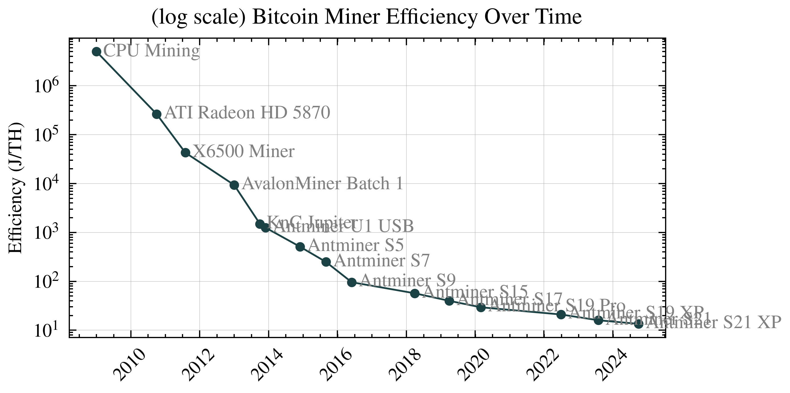

## Global Hashrate
Each miner contributes computational power, known as "hashrate," to secure the Bitcoin network by validating transactions and solving cryptographic puzzles. When aggregated globally, these individual contributions form the total network hashrate, a measure of the overall computational strength dedicated to Bitcoin mining. Hashrate is typically measured in Terahashes per second (TH/s)[^onchain1]

[^onchain1]: Onchain data was downloaded from [https://www.blockchain.com/explorer/charts/hash-rate](https://www.blockchain.com/explorer/charts/hash-rate). 

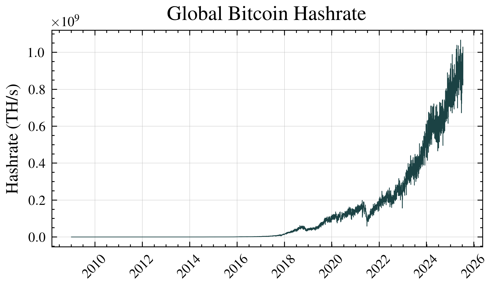

By multiplying the global hashrate with miner efficiency, we can calculate the total Bitcoin-network's energy consumption in Watts.

$$ \text{Power Consumption}(W) = \text{Miner Efficiency} \left(\frac{J}{TH}\right) \times \text{Global Hashrate} \left(\frac{TH}{s}\right) $$

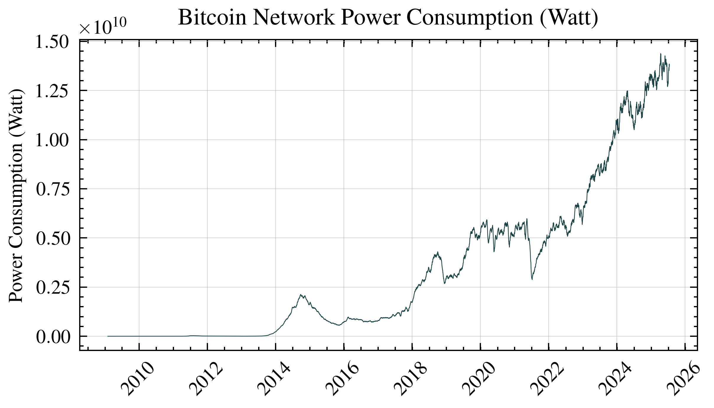

## Miner Rewards
Successful miners receive both block rewards and transaction fees. Block rewards follow a predetermined schedule established by Satoshi Nakamoto, starting at 50 Bitcoins per block initially. This reward is programmed to halve approximately every four years—an event known as the "halving"—to systematically decrease the rate at which new Bitcoins enter circulation. The first halving occurred in 2012, reducing the block reward to 25 Bitcoins. Subsequent halvings took place in 2016 (12.5 Bitcoins), 2020 (6.25 Bitcoins) and 2024 (3.125 Bitcoins), with future halvings continuing approximately every four years. Ultimately, due to this geometric series of reductions, the total number of Bitcoins that will ever exist is capped at precisely 21 million coins, a fixed supply limit integral to Bitcoin's value proposition. After this cap is reached—estimated to occur around the year 2140—miners will rely exclusively on transaction fees as their incentive.

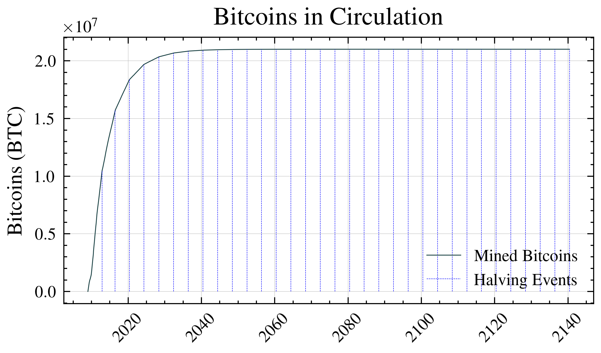

To calculate the total daily miner block rewards for all miners on a specific day, we multiply the block reward by the average number of blocks per day. Bitcoin aims to produce a block approximately every 10 minutes, resulting in around 144 blocks per day.

$$ \text{Daily Block Rewards} = \text{Blocks per day} \times \text{Reward per block} $$

Plugging in the current reward:

$$ 144 \text{ blocks/day} \times 3.125 \text{ BTC/block} = 450 \text{ BTC/day} $$

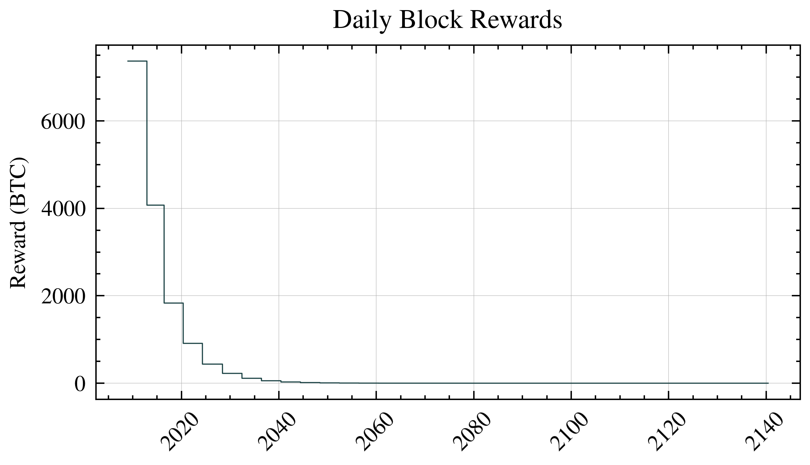

Transaction fees are payments made by network users when publishing transactions, whether for Bitcoin transfers, document timestamping, Bitcoin Ordinals, BRC-20 tokens, or other purposes. Fee amounts are market-driven, fluctuating based on network congestion. During periods of high activity, users compete for limited block space by offering higher transaction fees, incentivizing miners to prioritize their transactions for inclusion in the next block. As block rewards continue to halve, transaction fees are expected to become an increasingly significant component of miner revenue, ultimately becoming the primary incentive for securing the Bitcoin network after the total supply limit of 21 million Bitcoins has been reached.

Recently, innovative protocols such as Bitcoin Ordinals have introduced new use cases and dynamics to the Bitcoin blockchain. Ordinals enable users to inscribe digital assets like images, text, or other media directly onto individual satoshis (the smallest Bitcoin denomination), effectively creating non-fungible digital artifacts native to Bitcoin. Similarly, the emergence of BRC-20 tokens, a fungible token standard built using the Ordinals protocol, has introduced Ethereum-like fungible token functionality to the Bitcoin network, further increasing transaction volume and competition for block space. [^onchain2]

[^onchain2]: Onchain data was downloaded from [https://www.blockchain.com/explorer/charts/transaction-fees](https://www.blockchain.com/explorer/charts/transaction-fees). 

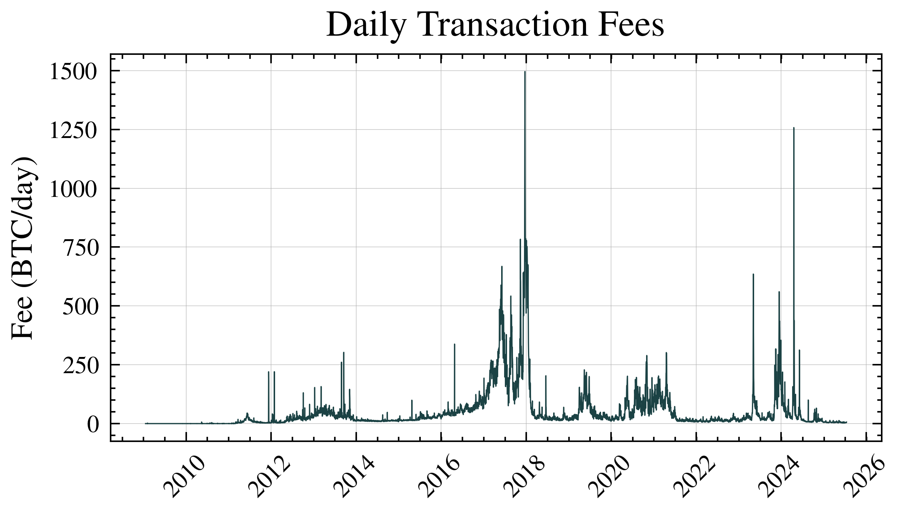

## Electricity Price
Miners seek the most cost-effective energy sources available because electricity represents their most significant operational expense. Reducing this cost directly increases profitability, particularly during periods when Bitcoin prices or mining difficulty levels fluctuate. Consequently, miners strategically locate mining operations in regions offering lower energy costs, favorable regulations, or renewable energy sources, such as hydropower, wind, solar, or geothermal energy, to further optimize expenses and improve environmental sustainability.

We are specifically interested in the average U.S. electricity prices for commercial users. Our objective is to estimate how much it would hypothetically cost us to mine Bitcoin ourselves, rather than simply purchasing Bitcoin directly from an exchange. By evaluating average commercial electricity rates, we can better understand our potential operational expenses, allowing us to compare the profitability of self-mining versus acquiring Bitcoin through traditional market channels. Such an analysis will inform strategic decisions about entering the mining business and help identify whether mining presents a cost-effective alternative to direct market purchases.

We will use electricity price data sourced from the **U.S. Energy Information Administration (EIA)** ([https://www.eia.gov/](https://www.eia.gov/)), as it provides accurate, comprehensive, and regularly updated information on average electricity rates for commercial and industrial consumers across various U.S. states.

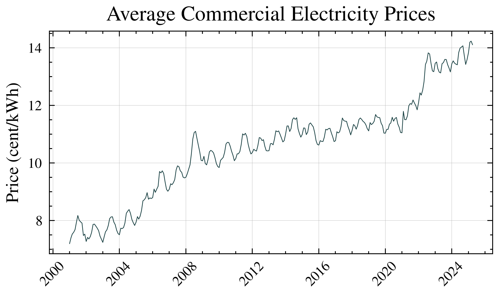

## Bitcoin Electricity Cost
To calculate the electricity cost per bitcoin, we divide the daily global energy consumption of the Bitcoin network by daily miner rewards (block rewards plus transaction fees). We are using commercial energy prices.

$$ \text{Cost Of Mining A Single Bitcoin}(USD) = \frac{ \frac{\text{Power Consumption} (W) \times 24}{1000} \times \frac{\text{Electricity Price} \left(\frac{cent}{kWh}\right)}{100} }{\text{Daily Block Rewards}+\text{Daily Transaction Fees}}$$

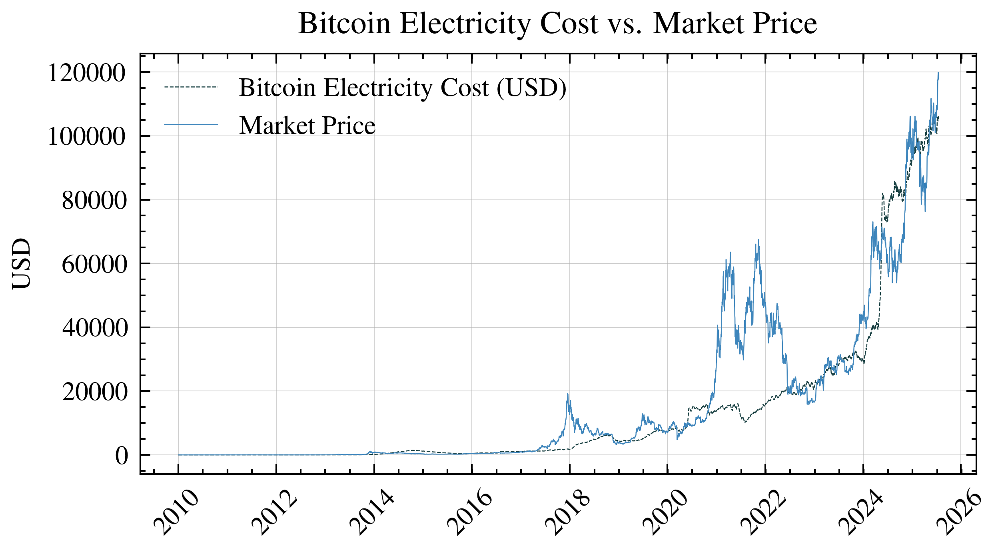

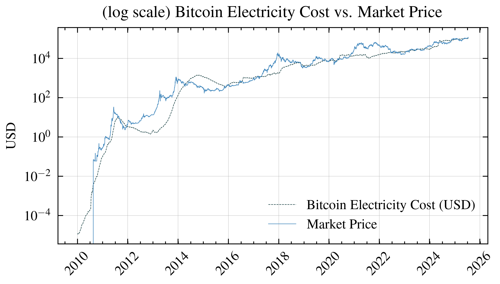

# Forecasting
For our forecasting analysis, we employ a combination of time series models to project future Bitcoin energy costs. 

Our forecasting model has several inherent limitations:
- Technological breakthroughs could drastically change miner efficiency
- Regulatory changes may impact mining operations
- Energy market volatility
- Difficulty predicting future transaction fees

**These projections should be interpreted cautiously and used only as one of many analytical tools.**

# Forecasting Energy Consumption of Bitcoin Network
Bitcoin network energy consumption appears to grow exponentially; however, since energy resources are finite and increasingly difficult to acquire, it is more realistic to model this growth using a logistic function. Logistic or sigmoid curves naturally represent many real-world phenomena, particularly in Diffusion of Innovations theory (learn more). We hypothesize that energy consumption serves as a proxy for Bitcoin adoption, closely tracking infrastructure investment. 

To forecast energy consumption, we adapt a logistic function with an upper asymptote set at 150% of the latest observed energy consumption value. This adjustment provides a conservative estimation for the potential maximum energy usage.

It is important to note that unforeseen events ("Black Swan" events), such as China's mining ban in 2021, may cause sudden drops or fluctuations in energy consumption that our models cannot predict.

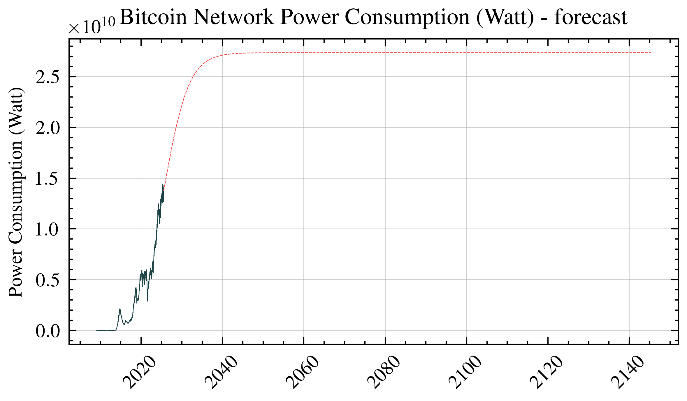

# Forecasting Transaction Fees
Another component closely tied to Bitcoin adoption is transaction fees. Given that each Bitcoin block is limited to approximately 1 MB of data, increased adoption of Bitcoin as a medium of exchange leads to higher transaction fees denominated in USD. However, as the BTC price increases, these fees expressed in terms of BTC may not rise significantly. We will model transaction fees as fluctuations (noise) around a sigmoid function anchored to the current value of the daily transaction fees.

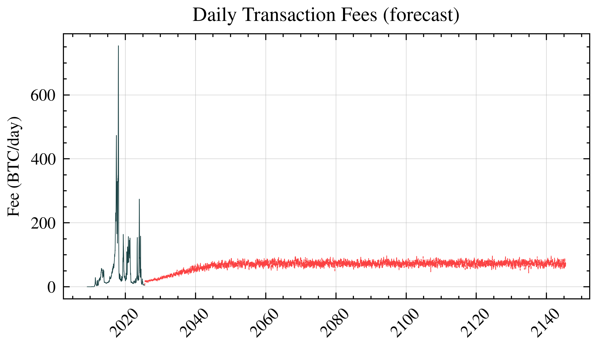

# Forecasting Energy Prices

Energy prices inherently include inflation. To accurately forecast energy prices over the long term, it's necessary to separate inflation from the underlying trend. For this purpose, we can use the Consumer Price Index (CPI), as it effectively represents broader inflationary pressures across the economy.

We use long term CPI data from [https://inflationdata.com/Inflation/Consumer_Price_Index/HistoricalCPI.aspx](https://inflationdata.com/Inflation/Consumer_Price_Index/HistoricalCPI.aspx)

We forecast CPI using a trend line fitted specifically to the historical data between 1980 and 2000 because this period represents relatively stable and consistent inflationary conditions, free from extreme economic disruptions like those observed during earlier decades (such as the oil crisis of the 1970s) or later significant events (such as the 2008 financial crisis or recent pandemic-related volatility).

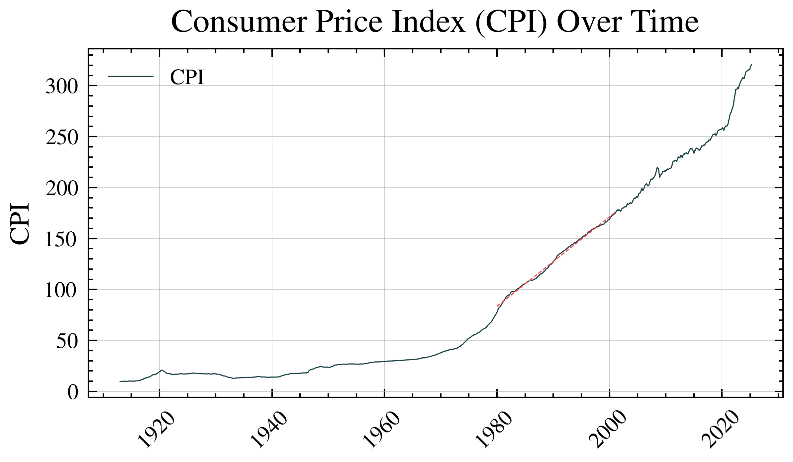

allowing us to make this kind of CPI forecast:
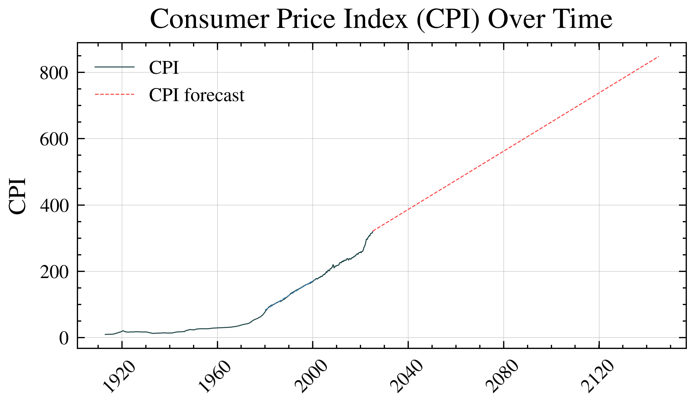

When we divide energy prices by the Consumer Price Index (CPI), we effectively remove or isolate the inflationary component from the overall energy price data. This process normalizes the prices, allowing us to clearly identify and analyze the underlying trends, seasonal patterns, and variable (non-inflationary) fluctuations.

Facebook Prophet [https://facebook.github.io/prophet/](https://facebook.github.io/prophet/) is a forecasting tool that uses an additive model combining trend, seasonal, and residual (noise) components to predict future values of time series data. In our approach, we apply Facebook Prophet specifically to energy prices after they've been normalized.

By multiplying the CPI forecast (which represents anticipated inflation) by the energy price forecast derived from Facebook Prophet (which captures the underlying trend and seasonality of energy prices after removing inflation), we reconstruct a realistic projection of future commercial energy prices.

In other words, the CPI forecast reintroduces inflation back into our previously normalized energy price forecast. This combination ensures that our final prediction reflects both inflationary trends and seasonal fluctuations specific to the energy market. 

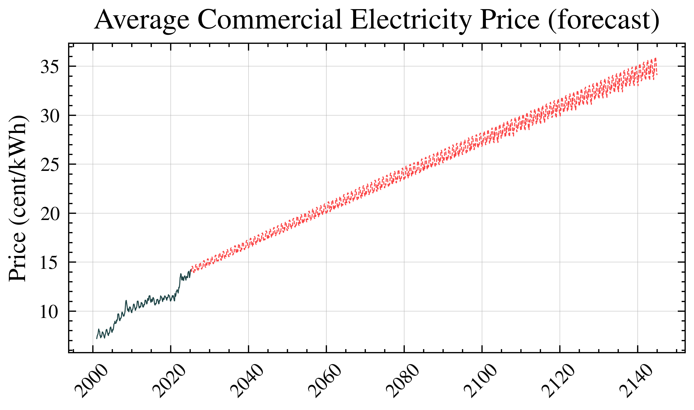

# Electricity Cost of A Single Bitcoin Mining – Forecast

By combining the individual forecasts for energy consumption, transaction fees, and energy prices described above, we derive a projection for Bitcoin electricity costs. Specifically:

- **Energy Consumption**: Forecasted using a logistic (sigmoid) growth model to realistically capture the adoption curve and saturation effects inherent in the Bitcoin network’s energy usage.
- **Transaction Fees**: Forecasted by applying fluctuations around a sigmoid trend, capturing both long-term adoption effects and short-term variability in network demand.
- **Energy Prices**: Forecasted by first removing inflation through CPI normalization, then reintroducing inflation using projected CPI trends combined with seasonality and underlying patterns identified by the Facebook Prophet forecasting model.

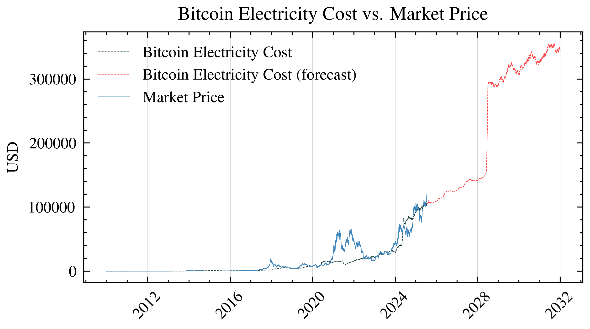

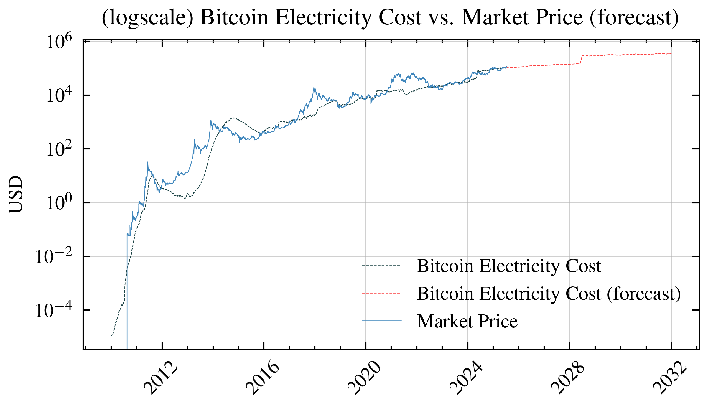

Zooming out to view long-term trends:

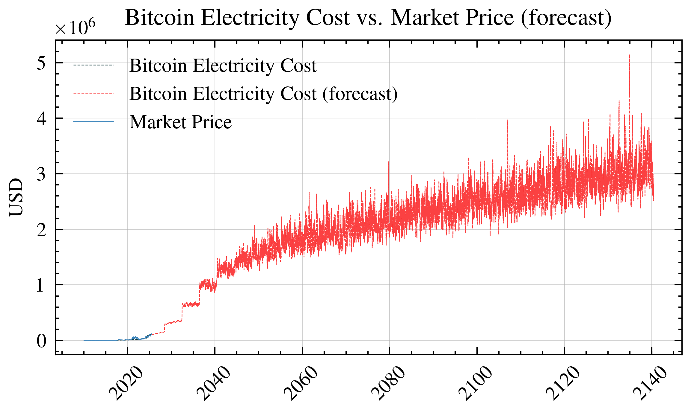

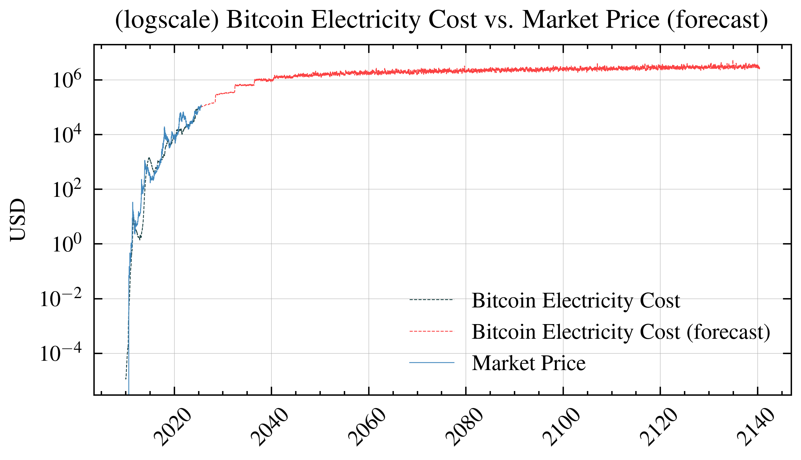

# Comparing to Stock-to-Flow (S2F)

The Stock-to-Flow (S2F) model assesses Bitcoin’s scarcity by comparing existing supply ("stock") to new annual issuance ("flow"). Popularized by PlanB, this model argues that Bitcoin's value increases predictably as its issuance rate declines every four years during halving events. 
1. The Bitcoin Energy Cost Model presented emphasizes mining efficiency, technological evolution, and energy prices to analyze Bitcoin’s valuation sustainability. Comparatively, the Stock-to-Flow (S2F) model centers around Bitcoin’s scarcity dynamics, highlighting halving events and reduced issuance rates to forecast future prices. 
2. The Stock-to-Flow (S2F) model uses arbitrary "magic numbers" within its equations, leading to speculative price predictions. Conversely, our Bitcoin Energy Cost Model is grounded in physics-based fundamentals, relying on measurable, transparent parameters like miner efficiency improvements, actual hardware performance, and real-world energy consumption

# Price Channels Defined by Bitcoin Electricity Cost (Hypothesis)
Our hypothesis suggests Bitcoin's price channels are established roughly 60 days after each halving event, as determined by the Bitcoin Electricity Cost Model. These channels form economic boundaries within which Bitcoin’s market price consistently oscillates.

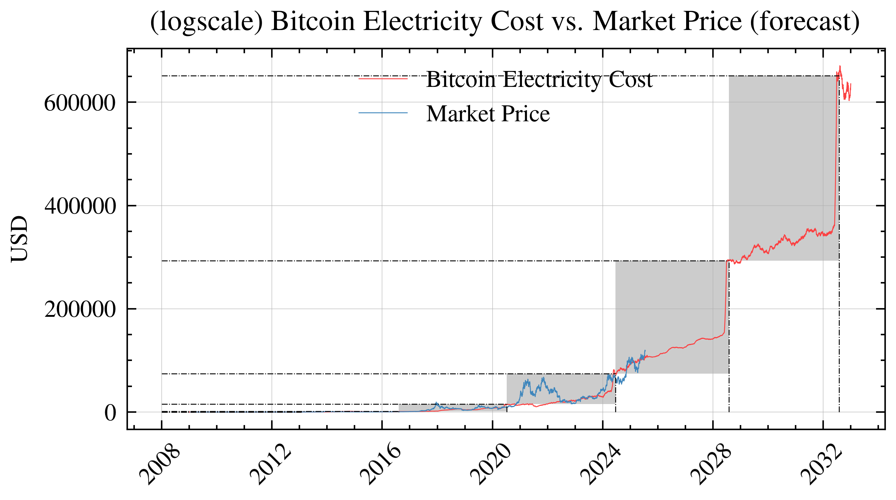

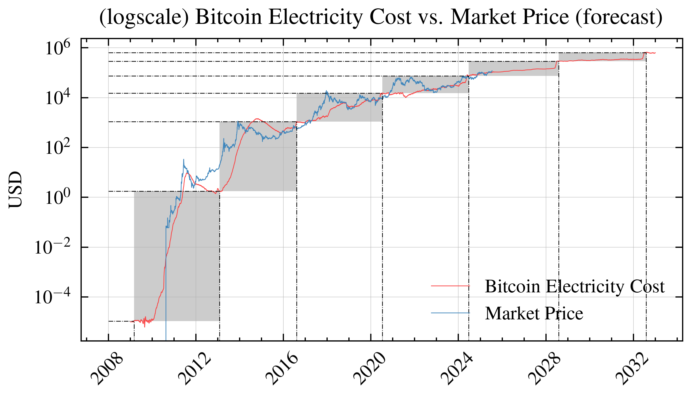